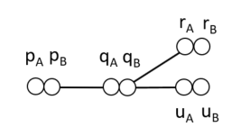
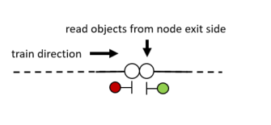

# Infrastructure

The `rolling` infrastructure model is conceptually a double node graph, which is similar to a graph, with the difference that each node has two sides. A train entering a node from an edge connected to one side of the node can only exit the node through edges on the opposide side of the node. 


On the railway network, paths p-q-r and p-q-u exist, in both directions. However, in a conventional undirected graph representation, there would also be a path r-q-u.


When we extend the graph concept to include two sides of each node, there is no longer a path r-q-u.



This model allows a sense of *local directedness* without deciding on a global direction concept such as up/down or outgoing/incoming often used in railway engineering. A global directionality requires considering special cases to handle railway networks where 
a train's up/down direction may change without the train reversing its direction, such as the [balloon loop example](examples/baloon.md).

Each side of the node may have a set of *objects*, which are read by a passing train on the **exit side** of the node, i.e. the opposite side of the node from the edge on which the train entered.



## Input format

The DGraph input file format consists of statements separated by whitespace which describe the double nodes, both sides together, and various edge types with corresponding lengths.

## Nodes

The syntax for describing nodes is as follows:

```haskell
node <name>[(<objects>)]-<name>[(<objects>)]
```

Examples:
```haskell
node n1-n2
node n2-n3(signal s1)
node n3(enter sec1)-n4
```


## Edges

Edges are either **linear**, **switches** or **boundaries**. Each node may only be mentioned in one edge statement. Nodes which are not mentioned in edge statements are assumed to be the end of a track.

### Linear

Linear edges simply connect two nodes by a length of track using the syntax `linear <node>-<node> <distance>`.

Example:
```haskell
linear n1-n2 124.5
```

### Switches

Switches 
Currently, only two-way switches are supported.

Example:
```haskell
switch sw1 left n1-(n2 200.0, n3 220.0)
```

### Boundaries

Boundaries are nodes where a train may enter or leave the model. When entering, the train's front simply appears at the node, while the body of the train is still outside of the model. When leaving, the front of the train visits the boundary node and the train travels on until the back of the train visits the boundary node, after which the train is considered to be finished.

The name of the boundary node is used in dispatch plans and in route files to refer to the location of the model boundary.

The syntax is `boundary <node>`.

Example:
```haskell
boundary n1
```
